# 🏗️ NextGen Expense Management System - Visual Architecture

## System Architecture Diagram

## Data Flow Architecture

## Microservices Communication

```mermaid
sequenceDiagram
    participant User as 👤 User
    participant Frontend as 🖥️ React App
    participant Gateway as 🚪 API Gateway
    participant Auth as 🔐 Auth Service
    participant Expense as 💰 Expense Service
    participant OCR as 📷 OCR Service
    participant Currency as 💱 Currency Service
    participant Approval as ✅ Approval Service
    participant Notification as 📧 Notification Service
    participant Database as 🗄️ MongoDB
    
    User->>Frontend: Login Request
    Frontend->>Gateway: POST /auth/login
    Gateway->>Auth: Authenticate User
    Auth->>Database: Verify Credentials
    Database-->>Auth: User Data
    Auth-->>Gateway: JWT Token
    Gateway-->>Frontend: Authentication Response
    Frontend-->>User: Dashboard
    
    User->>Frontend: Submit Expense + Receipt
    Frontend->>Gateway: POST /expenses (with file)
    Gateway->>Expense: Create Expense
    Expense->>OCR: Process Receipt
    OCR-->>Expense: Extracted Data
    Expense->>Currency: Convert Currency
    Currency-->>Expense: Converted Amount
    Expense->>Database: Save Expense
    Expense->>Approval: Trigger Approval Flow
    Approval->>Notification: Send Approval Request
    Notification-->>Approval: Notification Sent
    Approval-->>Expense: Approval Initiated
    Expense-->>Gateway: Expense Created
    Gateway-->>Frontend: Success Response
    Frontend-->>User: Confirmation
```

## Security Architecture

## Deployment Architecture

## Database Schema Relationships

## Technology Stack Overview

This visual architecture provides a comprehensive overview of the NextGen Expense Management System, showing all components, their relationships, data flow, security layers, and deployment structure.